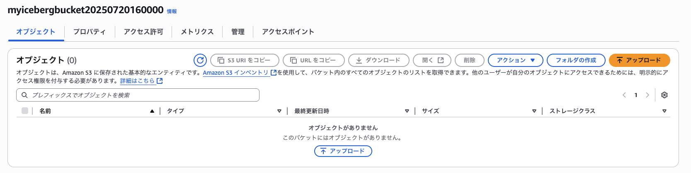
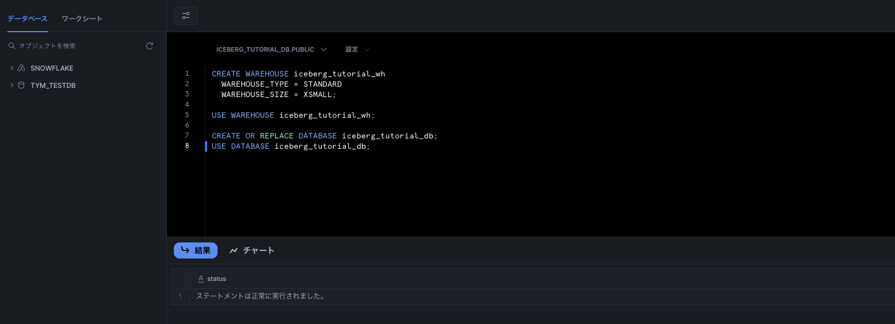
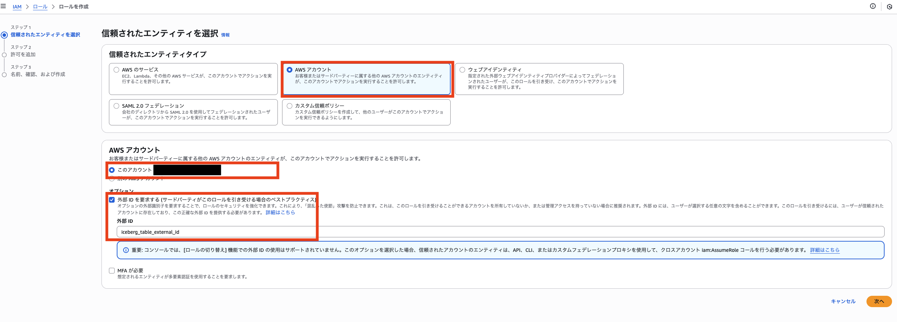
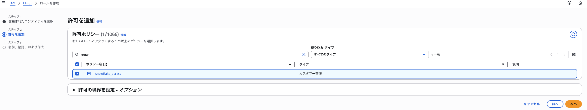
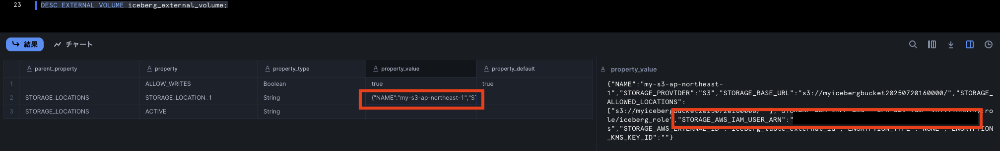
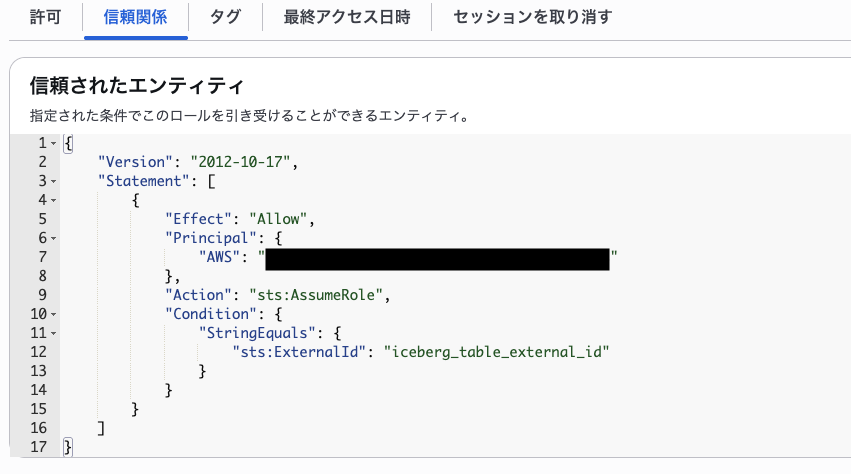
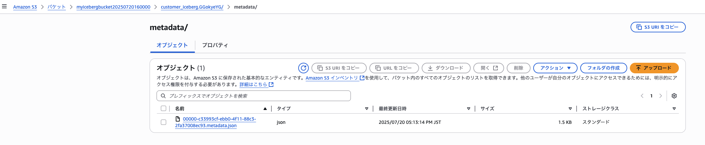
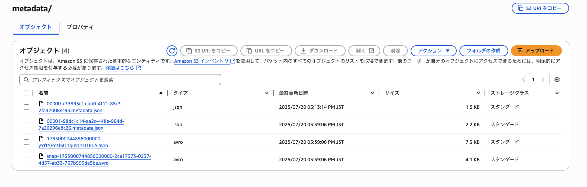
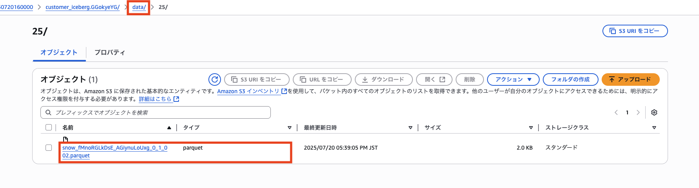

# Snowflake Iceberg Tableのチュートリアル

## 0. 事前準備
必要なものは下記の通り
- 自由に使えるSnowflakeアカウント
- 自由に使えるAWSアカウント<br>

S3バケットを作成しておく。



参考URLは下記の通り。<br>
https://docs.snowflake.com/ja/user-guide/tutorials/create-your-first-iceberg-table

## 1. ウェアハウスとデータベースを設定する



## 2. S3ロケーションへのアクセスを許可するIAMポリシーを作成する

### Security Token Service (STS)の有効性チェック
こちらはAWS側の作業。IAM > アカウント設定、と辿る。今回利用するリージョンで有効になっていなければ、トグルをスライドして有効にする。
の有効性チェック")

### ポリシー作成
命名：snowflake_access
```
{
    "Version": "2012-10-17",
    "Statement": [
        {
            "Effect": "Allow",
            "Action": [
                "s3:PutObject",
                "s3:GetObject",
                "s3:GetObjectVersion",
                "s3:DeleteObject",
                "s3:DeleteObjectVersion"
            ],
            "Resource": "arn:aws:s3:::myicebergbucket20250720160000/*"
        },
        {
            "Effect": "Allow",
            "Action": [
                "s3:ListBucket",
                "s3:GetBucketLocation"
            ],
            "Resource": "arn:aws:s3:::myicebergbucket20250720160000",
            "Condition": {
                "StringLike": {
                    "s3:prefix": [
                        "*"
                    ]
                }
            }
        }
    ]
}
```

### IAMロールを作成する
信頼されたエンティティタイプを「AWSアカウント」、AWSアカウントを「このアカウント」、外部IDを「iceberg_table_external_id」（名称はなんでもよい）で作成する。後のステップで、信頼関係を変更し、Snowflake にアクセスを許可します。


先ほど作成たポリシーをアタッチする。


ロール名を入力してロールを作成する。View role を選択すると、ロールの概要ページが表示されます。ロールの ARN （Amazonリソース名）値を探して記録します。

### Snowflakeで外部ボリュームを作成する
CREATE EXTERNAL VOLUME コマンドを使用して外部ボリュームを作成します。STORAGE_AWS_ROLE_ARNはView roleした値を記載。
```
CREATE OR REPLACE EXTERNAL VOLUME iceberg_external_volume
   STORAGE_LOCATIONS =
      (
         (
            NAME = 'my-s3-ap-northeast-1'
            STORAGE_PROVIDER = 'S3'
            STORAGE_BASE_URL = 's3://myicebergbucket20250720160000/'
            STORAGE_AWS_ROLE_ARN = '****'
            STORAGE_AWS_EXTERNAL_ID = 'iceberg_table_external_id'
         )
      );

```
### SnowflakeアカウントのAWS IAMユーザーを取得する
DESCRIBE EXTERNAL VOLUME コマンドを使用して、Snowflakeアカウント用に自動的に作成された AWS IAM ユーザーの ARN を取得します。外部ボリュームの名前を指定します。
```
DESC EXTERNAL VOLUME iceberg_external_volume;
```
STORAGE_AWS_IAM_USER_ARN プロパティの値を記録します。これは、Snowflakeアカウント用に作成された AWS IAM ユーザーです。


### バケットオブジェクトにアクセスするためにIAMユーザー権限を付与する
AWSに戻り、ロールの信頼関係を修正する。Principalを上記のSTORAGE_AWS_IAM_USER_ARNにする。（例では黒塗り）


## 3. テーブルを作成する
このステップでは2つの Apache Iceberg™ テーブルを作成します。1つは標準の CREATE ICEBERG TABLE 構文で、もう1つは CREATE ICEBERG TABLE ... AS SELECT 変数です。どちらのテーブルも、前の手順で設定した外部ボリュームを使用します。

### 標準構文を使用してテーブルを作成する
まず、標準的なCREATEICEBERGTABLE構文を使用してIcebergテーブルを作成します。<br>
テーブルがIcebergカタログとしてSnowflakeを使用するように、 CATALOG = 'SNOWFLAKE' を指定します。<br>
テーブルデータとメタデータの書き込み場所をSnowflakeに指示するには、 BASE_LOCATION パラメーターに値を指定します。<br>
この例では、テーブル名（customer_iceberg）を BASE_LOCATION に設定しています。<br>
この方法で、Snowflakeは外部ボリュームの場所にあるテーブルと同じ名前のディレクトリにデータとメタデータを書き込みます。
```
CREATE OR REPLACE ICEBERG TABLE customer_iceberg (
    c_custkey INTEGER,
    c_name STRING,
    c_address STRING,
    c_nationkey INTEGER,
    c_phone STRING,
    c_acctbal INTEGER,
    c_mktsegment STRING,
    c_comment STRING
)
    CATALOG = 'SNOWFLAKE'
    EXTERNAL_VOLUME = 'iceberg_external_volume'
    BASE_LOCATION = 'customer_iceberg';
```
正常終了を確認してS3を確認してみる。metadata.jsonができていることがわかる。


### データベースのカタログ統合と外部ボリュームを設定する
次に、このチュートリアルで作成した iceberg_tutorial_db に CATALOG と EXTERNAL_VOLUME パラメーターを設定します。パラメータを設定すると、変更後に作成される すべて のIcebergテーブルに、選択した特定のカタログと外部ボリュームを使用するようにSnowflakeに指示します。
```
ALTER DATABASE iceberg_tutorial_db SET CATALOG = 'SNOWFLAKE';
ALTER DATABASE iceberg_tutorial_db SET EXTERNAL_VOLUME = 'iceberg_external_volume';
SHOW PARAMETERS IN DATABASE ;
```

### CTASを使用してテーブルを作成する
サンプルデータを消しているため動作はしない。SQLだけ記載。
```
CREATE OR REPLACE ICEBERG TABLE nation_iceberg (
  n_nationkey INTEGER,
  n_name STRING
)
  BASE_LOCATION = 'nation_iceberg'
  AS SELECT
    N_NATIONKEY,
    N_NAME
  FROM snowflake_sample_data.tpch_sf1.nation;
```

## 4. データをロードしてテーブルをクエリする
チュートリアルに記載のSQLは動作しないため、自作して動作を確認する。
```
INSERT INTO customer_iceberg VALUES(1,'taro', 'tokyo', 10, '09012345678',1,'aaa','bbb');
```
S3を確認する。

この４ファイルを順に見えていく。<br>
1つ目：00000-c33993cf-ebb0-4f11-88c3-2fa37008ec93.metadata.json<br>
最初にテーブル作った時から存在するmetadata.json<br>
テーブル定義だけで、データも入っていないためマニフェストやスナップショットも空になっているようだ。
```
{
  "format-version" : 2,
  "table-uuid" : "0ef26120-4597-4f4e-aed4-a60770ab743b",
  "location" : "s3://myicebergbucket20250720160000/customer_iceberg.GGokyeYG/",
  "last-sequence-number" : 0,
  "last-updated-ms" : 1752999191607,
  "last-column-id" : 8,
  "current-schema-id" : 0,
  "schemas" : [ {
    "type" : "struct",
    "schema-id" : 0,
    "fields" : [ {
      "id" : 1,
      "name" : "C_CUSTKEY",
      "required" : false,
      "type" : "int"
    }, {
      "id" : 2,
      "name" : "C_NAME",
      "required" : false,
      "type" : "string"
    }, {
      "id" : 3,
      "name" : "C_ADDRESS",
      "required" : false,
      "type" : "string"
    }, {
      "id" : 4,
      "name" : "C_NATIONKEY",
      "required" : false,
      "type" : "int"
    }, {
      "id" : 5,
      "name" : "C_PHONE",
      "required" : false,
      "type" : "string"
    }, {
      "id" : 6,
      "name" : "C_ACCTBAL",
      "required" : false,
      "type" : "int"
    }, {
      "id" : 7,
      "name" : "C_MKTSEGMENT",
      "required" : false,
      "type" : "string"
    }, {
      "id" : 8,
      "name" : "C_COMMENT",
      "required" : false,
      "type" : "string"
    } ]
  } ],
  "default-spec-id" : 0,
  "partition-specs" : [ {
    "spec-id" : 0,
    "fields" : [ ]
  } ],
  "last-partition-id" : 999,
  "default-sort-order-id" : 0,
  "sort-orders" : [ {
    "order-id" : 0,
    "fields" : [ ]
  } ],
  "properties" : {
    "format-version" : "2"
  },
  "current-snapshot-id" : -1,
  "snapshots" : [ ],
  "snapshot-log" : [ ]
}
```
２ファイル目：00001-98dc1c14-aa2c-448e-964d-7a26296e8c26.metadata.json <br>
レコードをインサートしたときにできたmetadata.jsonで、データへを指し示すmanifest-listに値が入っている。<br>
またスナップショットも採番されている。
```
{
  "format-version" : 2,
  "table-uuid" : "0ef26120-4597-4f4e-aed4-a60770ab743b",
  "location" : "s3://myicebergbucket20250720160000/customer_iceberg.GGokyeYG/",
  "last-sequence-number" : 1,
  "last-updated-ms" : 1753000744856,
  "last-column-id" : 8,
  "current-schema-id" : 0,
  "schemas" : [ {
    "type" : "struct",
    "schema-id" : 0,
    "fields" : [ {
      "id" : 1,
      "name" : "C_CUSTKEY",
      "required" : false,
      "type" : "int"
    }, {
      "id" : 2,
      "name" : "C_NAME",
      "required" : false,
      "type" : "string"
    }, {
      "id" : 3,
      "name" : "C_ADDRESS",
      "required" : false,
      "type" : "string"
    }, {
      "id" : 4,
      "name" : "C_NATIONKEY",
      "required" : false,
      "type" : "int"
    }, {
      "id" : 5,
      "name" : "C_PHONE",
      "required" : false,
      "type" : "string"
    }, {
      "id" : 6,
      "name" : "C_ACCTBAL",
      "required" : false,
      "type" : "int"
    }, {
      "id" : 7,
      "name" : "C_MKTSEGMENT",
      "required" : false,
      "type" : "string"
    }, {
      "id" : 8,
      "name" : "C_COMMENT",
      "required" : false,
      "type" : "string"
    } ]
  } ],
  "default-spec-id" : 0,
  "partition-specs" : [ {
    "spec-id" : 0,
    "fields" : [ ]
  } ],
  "last-partition-id" : 999,
  "default-sort-order-id" : 0,
  "sort-orders" : [ {
    "order-id" : 0,
    "fields" : [ ]
  } ],
  "properties" : {
    "format-version" : "2"
  },
  "current-snapshot-id" : 6459076906609002355,
  "snapshots" : [ {
    "sequence-number" : 1,
    "snapshot-id" : 6459076906609002355,
    "timestamp-ms" : 1753000744856,
    "manifest-list" : "s3://myicebergbucket20250720160000/customer_iceberg.GGokyeYG/metadata/snap-1753000744856000000-2ca17373-0237-4d57-ab33-767b999de5be.avro",
    "schema-id" : 0,
    "summary" : {
      "added-files-size" : "2048",
      "manifests-kept" : "0",
      "operation" : "append",
      "total-files-size" : "2048",
      "added-records" : "1",
      "added-data-files" : "1",
      "manifests-replaced" : "0",
      "total-data-files" : "1",
      "manifests-created" : "1",
      "total-records" : "1"
    }
  } ],
  "snapshot-log" : [ {
    "snapshot-id" : 6459076906609002355,
    "timestamp-ms" : 1753000744856
  } ]
}
```
３ファイル目：1753000744856000000-yYftYFY3lSO1qleD1O1ELA.avro<br>
ビューワーアドインがうまく動かずpythonで書きました。<br>
```
import avro.io
import avro.datafile
import pprint
import json

filename = "snap-1753000744856000000-2ca17373-0237-4d57-ab33-767b999de5be.avro"

# ファイルをバイナリモードで読み込む
with open(filename, "rb") as f:
    # リーダーを作成
    reader = avro.datafile.DataFileReader(f, avro.io.DatumReader())

    # データを取得。dict型で取得できる
    for data in reader:
        pprint.pprint(data)

    # スキーマを取得
    schema_str = reader.meta['avro.schema']
    schema_json = json.loads(schema_str)
    pprint.pprint(schema_json)
```
順序逆になりますが、こちらがmanifest fileです。データファイルのパスを示しています。
```
{'data_file': {'column_sizes': None,
               'content': 0,
               'equality_ids': None,
               'file_format': 'PARQUET',
               'file_path': 's3://myicebergbucket20250720160000/customer_iceberg.GGokyeYG/data/25/snow_fMnoRGLkDsE_AGiynuLoUxg_0_1_002.parquet',
               'file_size_in_bytes': 2048,
               'key_metadata': None,
               'lower_bounds': [{'key': 1, 'value': b'\x01\x00\x00\x00'},
                                {'key': 2, 'value': b'taro'},
                                {'key': 3, 'value': b'tokyo'},
                                {'key': 4, 'value': b'\n\x00\x00\x00'},
                                {'key': 5, 'value': b'09012345678'},
                                {'key': 6, 'value': b'\x01\x00\x00\x00'},
                                {'key': 7, 'value': b'aaa'},
                                {'key': 8, 'value': b'bbb'}],
               'nan_value_counts': None,
               'null_value_counts': [{'key': 1, 'value': 0},
                                     {'key': 2, 'value': 0},
                                     {'key': 3, 'value': 0},
                                     {'key': 4, 'value': 0},
                                     {'key': 5, 'value': 0},
                                     {'key': 6, 'value': 0},
                                     {'key': 7, 'value': 0},
                                     {'key': 8, 'value': 0}],
               'partition': {},
               'record_count': 1,
               'referenced_data_file': None,
               'sort_order_id': 0,
               'split_offsets': None,
               'upper_bounds': [{'key': 1, 'value': b'\x01\x00\x00\x00'},
                                {'key': 2, 'value': b'taro'},
                                {'key': 3, 'value': b'tokyo'},
                                {'key': 4, 'value': b'\n\x00\x00\x00'},
                                {'key': 5, 'value': b'09012345678'},
                                {'key': 6, 'value': b'\x01\x00\x00\x00'},
                                {'key': 7, 'value': b'aaa'},
                                {'key': 8, 'value': b'bbb'}],
               'value_counts': [{'key': 1, 'value': 1},
                                {'key': 2, 'value': 1},
                                {'key': 3, 'value': 1},
                                {'key': 4, 'value': 1},
                                {'key': 5, 'value': 1},
                                {'key': 6, 'value': 1},
                                {'key': 7, 'value': 1},
                                {'key': 8, 'value': 1}]},
 'file_sequence_number': None,
 'sequence_number': 1,
 'snapshot_id': 6459076906609002355,
 'status': 1}
{'fields': [{'field-id': 0, 'name': 'status', 'type': 'int'},
            {'default': None,
             'field-id': 1,
             'name': 'snapshot_id',
             'type': ['null', 'long']},
            {'default': None,
             'field-id': 3,
             'name': 'sequence_number',
             'type': ['null', 'long']},
            {'default': None,
             'field-id': 4,
             'name': 'file_sequence_number',
             'type': ['null', 'long']},
            {'field-id': 2,
             'name': 'data_file',
             'type': {'fields': [{'doc': 'Contents of the file: 0=data, '
                                         '1=position deletes, 2=equality '
                                         'deletes',
                                  'field-id': 134,
                                  'name': 'content',
                                  'type': 'int'},
                                 {'doc': 'Location URI with FS scheme',
                                  'field-id': 100,
                                  'name': 'file_path',
                                  'type': 'string'},
                                 {'doc': 'File format name: avro, orc, or '
                                         'parquet',
                                  'field-id': 101,
                                  'name': 'file_format',
                                  'type': 'string'},
                                 {'doc': 'Partition data tuple, schema based '
                                         'on the partition spec',
                                  'field-id': 102,
                                  'name': 'partition',
                                  'type': {'fields': [],
                                           'name': 'r102',
                                           'type': 'record'}},
                                 {'doc': 'Number of records in the file',
                                  'field-id': 103,
                                  'name': 'record_count',
                                  'type': 'long'},
                                 {'doc': 'Total file size in bytes',
                                  'field-id': 104,
                                  'name': 'file_size_in_bytes',
                                  'type': 'long'},
                                 {'default': None,
                                  'doc': 'Map of column id to total size on '
                                         'disk',
                                  'field-id': 108,
                                  'name': 'column_sizes',
                                  'type': ['null',
                                           {'items': {'fields': [{'field-id': 117,
                                                                  'name': 'key',
                                                                  'type': 'int'},
                                                                 {'field-id': 118,
                                                                  'name': 'value',
                                                                  'type': 'long'}],
                                                      'name': 'k117_v118',
                                                      'type': 'record'},
                                            'logicalType': 'map',
                                            'type': 'array'}]},
                                 {'default': None,
                                  'doc': 'Map of column id to total count, '
                                         'including null and NaN',
                                  'field-id': 109,
                                  'name': 'value_counts',
                                  'type': ['null',
                                           {'items': {'fields': [{'field-id': 119,
                                                                  'name': 'key',
                                                                  'type': 'int'},
                                                                 {'field-id': 120,
                                                                  'name': 'value',
                                                                  'type': 'long'}],
                                                      'name': 'k119_v120',
                                                      'type': 'record'},
                                            'logicalType': 'map',
                                            'type': 'array'}]},
                                 {'default': None,
                                  'doc': 'Map of column id to null value count',
                                  'field-id': 110,
                                  'name': 'null_value_counts',
                                  'type': ['null',
                                           {'items': {'fields': [{'field-id': 121,
                                                                  'name': 'key',
                                                                  'type': 'int'},
                                                                 {'field-id': 122,
                                                                  'name': 'value',
                                                                  'type': 'long'}],
                                                      'name': 'k121_v122',
                                                      'type': 'record'},
                                            'logicalType': 'map',
                                            'type': 'array'}]},
                                 {'default': None,
                                  'doc': 'Map of column id to number of NaN '
                                         'values in the column',
                                  'field-id': 137,
                                  'name': 'nan_value_counts',
                                  'type': ['null',
                                           {'items': {'fields': [{'field-id': 138,
                                                                  'name': 'key',
                                                                  'type': 'int'},
                                                                 {'field-id': 139,
                                                                  'name': 'value',
                                                                  'type': 'long'}],
                                                      'name': 'k138_v139',
                                                      'type': 'record'},
                                            'logicalType': 'map',
                                            'type': 'array'}]},
                                 {'default': None,
                                  'doc': 'Map of column id to lower bound',
                                  'field-id': 125,
                                  'name': 'lower_bounds',
                                  'type': ['null',
                                           {'items': {'fields': [{'field-id': 126,
                                                                  'name': 'key',
                                                                  'type': 'int'},
                                                                 {'field-id': 127,
                                                                  'name': 'value',
                                                                  'type': 'bytes'}],
                                                      'name': 'k126_v127',
                                                      'type': 'record'},
                                            'logicalType': 'map',
                                            'type': 'array'}]},
                                 {'default': None,
                                  'doc': 'Map of column id to upper bound',
                                  'field-id': 128,
                                  'name': 'upper_bounds',
                                  'type': ['null',
                                           {'items': {'fields': [{'field-id': 129,
                                                                  'name': 'key',
                                                                  'type': 'int'},
                                                                 {'field-id': 130,
                                                                  'name': 'value',
                                                                  'type': 'bytes'}],
                                                      'name': 'k129_v130',
                                                      'type': 'record'},
                                            'logicalType': 'map',
                                            'type': 'array'}]},
                                 {'default': None,
                                  'doc': 'Encryption key metadata blob',
                                  'field-id': 131,
                                  'name': 'key_metadata',
                                  'type': ['null', 'bytes']},
                                 {'default': None,
                                  'doc': 'Splittable offsets',
                                  'field-id': 132,
                                  'name': 'split_offsets',
                                  'type': ['null',
                                           {'element-id': 133,
                                            'items': 'long',
                                            'type': 'array'}]},
                                 {'default': None,
                                  'doc': 'Equality comparison field IDs',
                                  'field-id': 135,
                                  'name': 'equality_ids',
                                  'type': ['null',
                                           {'element-id': 136,
                                            'items': 'int',
                                            'type': 'array'}]},
                                 {'default': None,
                                  'doc': 'Sort order ID',
                                  'field-id': 140,
                                  'name': 'sort_order_id',
                                  'type': ['null', 'int']},
                                 {'default': None,
                                  'doc': 'Fully qualified location (URI with '
                                         'FS scheme) of a data file that all '
                                         'deletes reference',
                                  'field-id': 143,
                                  'name': 'referenced_data_file',
                                  'type': ['null', 'string']}],
                      'name': 'r2',
                      'type': 'record'}}],
 'name': 'manifest_entry',
 'type': 'record'}
```
４ファイル目：snap-1753000744856000000-2ca17373-0237-4d57-ab33-767b999de5be.avro<br>
こちらがmanifest-listになります。manifest fileの場所を示しています。
```
{'added_files_count': 1,
 'added_rows_count': 1,
 'added_snapshot_id': 6459076906609002355,
 'content': 0,
 'deleted_files_count': 0,
 'deleted_rows_count': 0,
 'existing_files_count': 0,
 'existing_rows_count': 0,
 'manifest_length': 7461,
 'manifest_path': 's3://myicebergbucket20250720160000/customer_iceberg.GGokyeYG/metadata/1753000744856000000-yYftYFY3lSO1qleD1O1ELA.avro',
 'min_sequence_number': 1,
 'partition_spec_id': 0,
 'partitions': [],
 'sequence_number': 1}
{'fields': [{'doc': 'Location URI with FS scheme',
             'field-id': 500,
             'name': 'manifest_path',
             'type': 'string'},
            {'doc': 'Total file size in bytes',
             'field-id': 501,
             'name': 'manifest_length',
             'type': 'long'},
            {'doc': 'Spec ID used to write',
             'field-id': 502,
             'name': 'partition_spec_id',
             'type': 'int'},
            {'doc': 'Contents of the manifest: 0=data, 1=deletes',
             'field-id': 517,
             'name': 'content',
             'type': 'int'},
            {'doc': 'Sequence number when the manifest was added',
             'field-id': 515,
             'name': 'sequence_number',
             'type': 'long'},
            {'doc': 'Lowest sequence number in the manifest',
             'field-id': 516,
             'name': 'min_sequence_number',
             'type': 'long'},
            {'doc': 'Snapshot ID that added the manifest',
             'field-id': 503,
             'name': 'added_snapshot_id',
             'type': 'long'},
            {'doc': 'Added entry count',
             'field-id': 504,
             'name': 'added_files_count',
             'type': 'int'},
            {'doc': 'Existing entry count',
             'field-id': 505,
             'name': 'existing_files_count',
             'type': 'int'},
            {'doc': 'Deleted entry count',
             'field-id': 506,
             'name': 'deleted_files_count',
             'type': 'int'},
            {'doc': 'Added rows count',
             'field-id': 512,
             'name': 'added_rows_count',
             'type': 'long'},
            {'doc': 'Existing rows count',
             'field-id': 513,
             'name': 'existing_rows_count',
             'type': 'long'},
            {'doc': 'Deleted rows count',
             'field-id': 514,
             'name': 'deleted_rows_count',
             'type': 'long'},
            {'default': None,
             'doc': 'Summary for each partition',
             'field-id': 507,
             'name': 'partitions',
             'type': ['null',
                      {'element-id': 508,
                       'items': {'fields': [{'doc': 'True if any file has a '
                                                    'null partition value',
                                             'field-id': 509,
                                             'name': 'contains_null',
                                             'type': 'boolean'},
                                            {'default': None,
                                             'doc': 'True if any file has a '
                                                    'nan partition value',
                                             'field-id': 518,
                                             'name': 'contains_nan',
                                             'type': ['null', 'boolean']},
                                            {'default': None,
                                             'doc': 'Partition lower bound for '
                                                    'all files',
                                             'field-id': 510,
                                             'name': 'lower_bound',
                                             'type': ['null', 'bytes']},
                                            {'default': None,
                                             'doc': 'Partition upper bound for '
                                                    'all files',
                                             'field-id': 511,
                                             'name': 'upper_bound',
                                             'type': ['null', 'bytes']}],
                                 'name': 'r508',
                                 'type': 'record'},
                       'type': 'array'}]}],
 'name': 'manifest_file',
 'type': 'record'}
```
また、肝心のデータファイルはdataフォルダ、プレフィクスの下に生成されています。<br>


