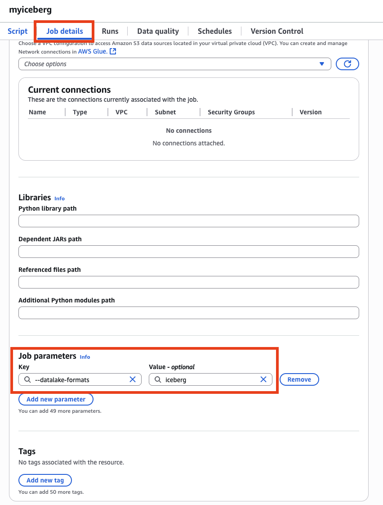
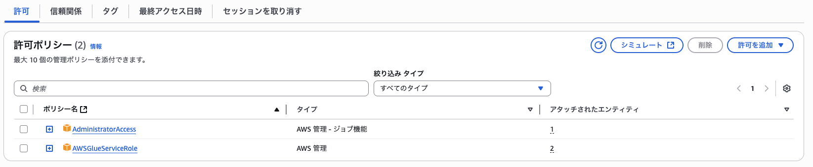
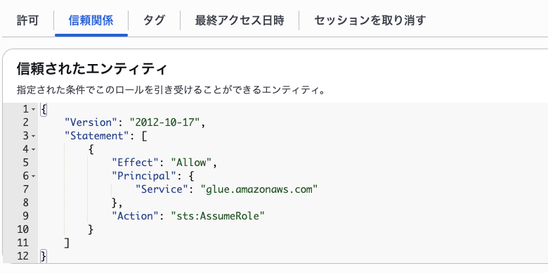
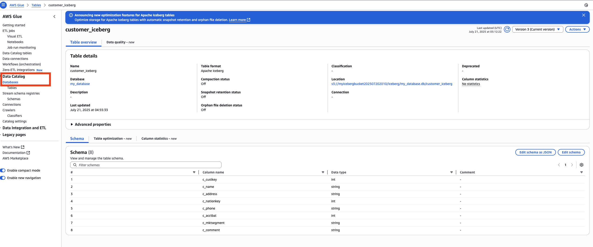
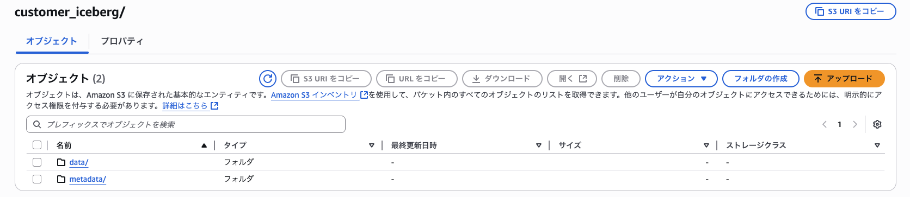

# Glue Iceberg Table

## 0. 概要
難しい話を聞く前に、SnowflakeでIcebergテーブルを作りデータをインサートすればIcebergテーブルを作成できるが、別の方法としてGlueでIcebergテーブルを作り、Snowflakeにカタログ統合して参照することを試しておく。

## 1. Glue側の設定、コード
GlueのIceberg置き場としてS3バケットを作成しておく。（myicebergbucket202507202010）<br>
Glueジョブのコードは下記の通り。
```
from pyspark.sql import SparkSession

spark = SparkSession.builder \
    .config("spark.sql.extensions", "org.apache.iceberg.spark.extensions.IcebergSparkSessionExtensions") \
    .config("spark.sql.catalog.glue_iceberg", "org.apache.iceberg.spark.SparkCatalog") \
    .config("spark.sql.catalog.glue_iceberg.warehouse", "s3://myicebergbucket202507202010/iceberg/") \
    .config("spark.sql.catalog.glue_iceberg.catalog-impl", "org.apache.iceberg.aws.glue.GlueCatalog") \
    .config("spark.sql.catalog.glue_iceberg.io-impl", "org.apache.iceberg.aws.s3.S3FileIO") \
    .getOrCreate()


spark.sql("CREATE DATABASE IF NOT EXISTS glue_iceberg.my_database")

query = """
CREATE TABLE IF NOT EXISTS glue_iceberg.my_database.customer_iceberg (
    c_custkey INTEGER,
    c_name STRING,
    c_address STRING,
    c_nationkey INTEGER,
    c_phone STRING,
    c_acctbal INTEGER,
    c_mktsegment STRING,
    c_comment STRING
)
USING iceberg
TBLPROPERTIES ('format-version'='2')
"""

spark.sql(query)

query = """
INSERT INTO glue_iceberg.my_database.customer_iceberg VALUES(1,'taro', 'tokyo', 10, '09012345678',1,'aaa','bbb')
"""

spark.sql(query)


query = """
INSERT INTO glue_iceberg.my_database.customer_iceberg VALUES(2,'hanako', 'osaka', 20, '08012345678',2,'ccc','ddd')
"""

spark.sql(query)

```
また起動パラメータとして下記を設定している。


glueの実行ロールは下記の通り。



正常に動作すると、GlueのデータカタログとS3上に生成されたicebergテーブルのファイル群を確認することができる。




## 2. Snowflake側で見れるように設定する（カタログ統合）

外部ボリュームを構成するあたりは前回と同じであるため、主にSQLだけ記載しています。
```
-- Glueで作ったIcebergテーブルを読み込む用のデータベースを作成
CREATE OR REPLACE DATABASE iceberg_tutorial_db_glue;
USE DATABASE iceberg_tutorial_db_glue;

-- 外部ボリュームとして、GlueのIcebergストレージを指定。
CREATE OR REPLACE EXTERNAL VOLUME iceberg_external_volume_glue
   ALLOW_WRITES=false
   STORAGE_LOCATIONS =
      (
         (
            NAME = 'my-s3-glue-ap-northeast-1'
            STORAGE_PROVIDER = 'S3'
            STORAGE_BASE_URL = 's3://myicebergbucket202507202010/'
            STORAGE_AWS_ROLE_ARN = 'arn:aws:iam::<account id>:role/iceberg_role'
            STORAGE_AWS_EXTERNAL_ID = 'iceberg_table_external_id'
         )
      );

-- AWS側のIAMロールの信頼関係の更新などは前回と同じ。
DESC EXTERNAL VOLUME iceberg_external_volume_glue;

-- Glueのカタログ統合を行う。AWS側では外部ボリュームの場合と同じようにIAMロールを作成している。（同じ手続きであるため詳細は割愛）
CREATE OR REPLACE CATALOG INTEGRATION glueCatalogInt
  CATALOG_SOURCE = GLUE
  CATALOG_NAMESPACE = 'my_database'
  TABLE_FORMAT = ICEBERG
  GLUE_AWS_ROLE_ARN = 'arn:aws:iam::<account id>:role/snowflake_glue_role'
  GLUE_CATALOG_ID = '<account id>'
  GLUE_REGION = 'ap-northeast-1'
  ENABLED = TRUE;

-- 信頼関係のプリンシパルと外部IDの更新は、外部ボリュームの場合と同じ
DESCRIBE CATALOG INTEGRATION glueCatalogInt;

-- Snowflake側でテーブルを作成。
-- カタログの指定を前回の「SNOWFLAKE」から「glueCatalogInt」に変更している。
-- すでに存在するテーブルを読み込むため、テーブル定義なども無い。
CREATE OR REPLACE ICEBERG TABLE customer_iceberg_glue
  CATALOG = 'glueCatalogInt'
  CATALOG_NAMESPACE  = 'my_database'
  CATALOG_TABLE_NAME = 'customer_iceberg'
  EXTERNAL_VOLUME = 'iceberg_external_volume_glue'
  AUTO_REFRESH       = TRUE
;

-- 見れることを確認。Glue側でデータを追加しても、追加が反映されていることなども確認。
SELECT * FROM customer_iceberg_glue;
```

## 3. 終わりに
今回のGlueカタログの読み込みの方式は、今後（今も？）最新化が図られていく模様。<br>
S3テーブルの登場や、ICEBERG REST連携など新しいカタログ連携方式が出てきているため、最新情報を追うようにしたい。<br>
が、触らないと多分話についていけない（分かった気になるだけ）ので時間のある時にやって、自分なりに断面（起点）作った方が良い。（と思う）<br>
参考：https://zenn.dev/dataheroes/articles/20250512-snowflake-catalog-integration-s3tables#fn-a452-1
